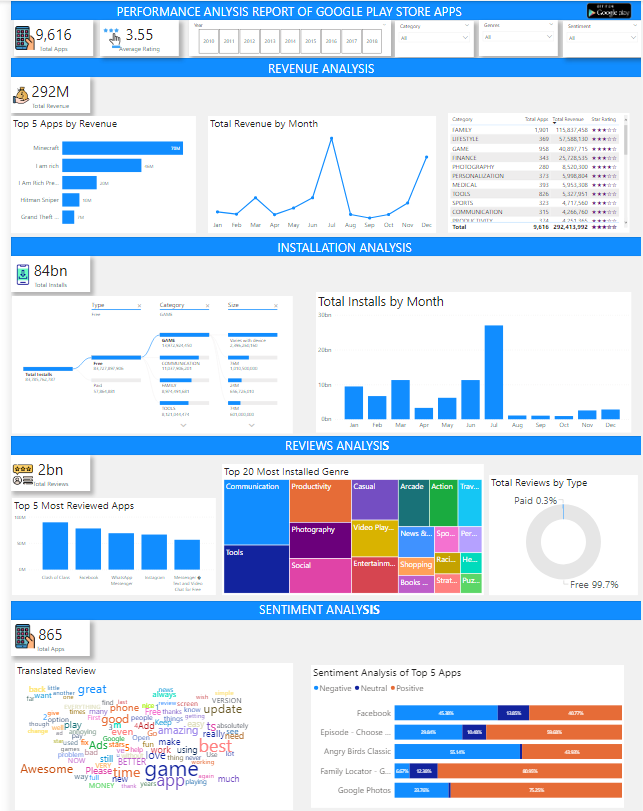
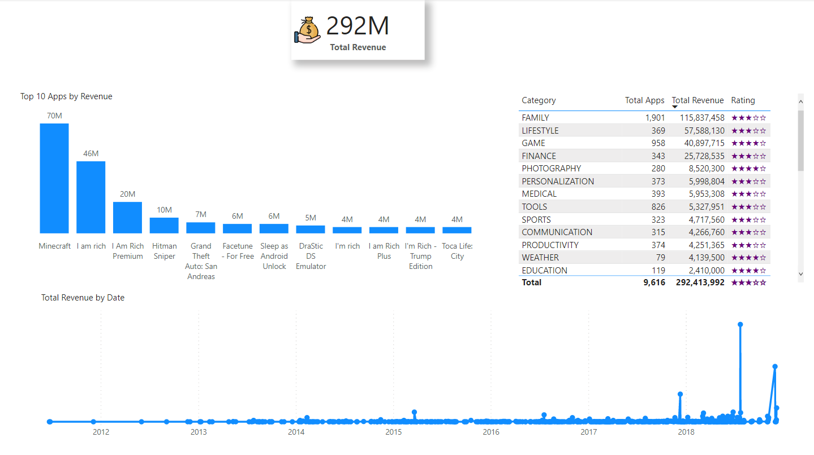
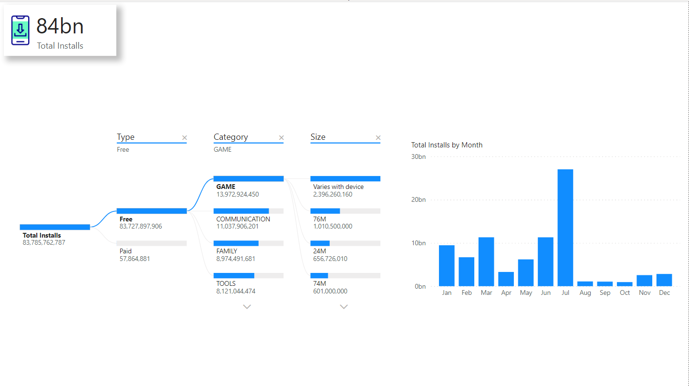
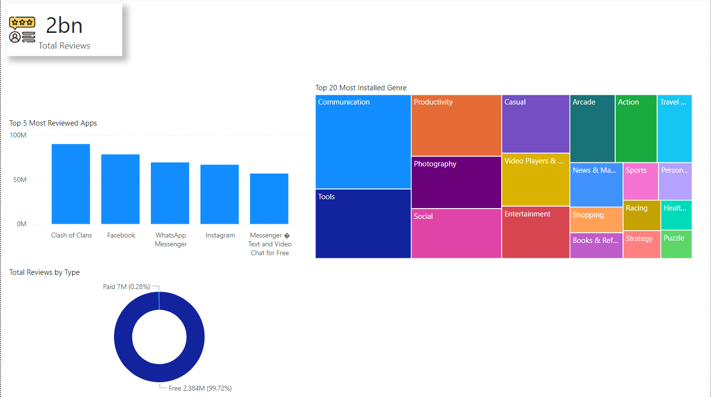
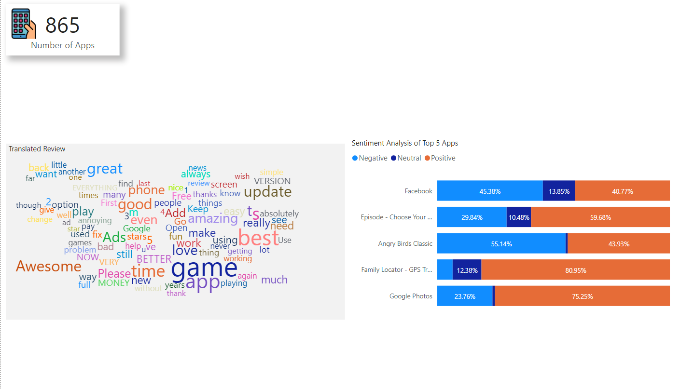

# An automated comment analysis project for GitHub and playstore

An analysis and visualization of google play store apps scraped data for the period of 2010 - 2018 . This project aims at cleaning the dataset, analyzing the given dataset, and mining informational quality insights. This project also involves visualizing the data to better and easily understand trends and different categories.

## Table of contents

- [About](#about)
- [Project Description](#project-description)
- [Dataset](#dataset)
- [Research Questions](#research-questions)
- [Links](#links)
- [Built with](#built-with)
- [Analysis and Visualizations](#analysis-and-visualizations)
- [Contributors](#contributors)
  -[Team Anchor](#team-anchor)
- [Acknowledgements](#acknowledgements)

## About

In this project, I'd be working on a real-world dataset of the google play store, one of the most used applications for downloading android apps. This project aims on cleaning the dataset, analyze the given dataset, and mining informational quality insights. This project also involves visualizing the data to better and easily understand trends and different categories.

## Project Description

This project will help one understand how a real-world database is analyzed using SQL, how to get maximum available insights from the dataset, pre-process the data using python for a better upcoming performance, how a structured query language helps us retrieve useful information from the database, and visualize the data with the power bi tool. The Project will consist of 2 modules:

Module 1: Pre-processing, Analyzing data using Python and SQL.

Module 2: Visualizing data using Power BI.

## Dataset

- This **[data set](https://drive.google.com/file/d/19fVBgoQJr5jkupe0O9Ht8VeMqSVaBJae/view?usp=share_link)** contains two csv  files of data scraped from google play store app for the period of 2010 - 2018.  The first dataset - `apps` contains data on play store apps and its attributes, while the other dataset - `reviews` containing data on customer reviews for each playstore app.  

- Key variables in the dataset includes :

**apps dataset**

| variables | Details |
| --------------------- | ---------------------- |
| App | google play store app name |
| Category | such as ART_AND_DESIGN', 'AUTO_AND_VEHICLES', 'BEAUTY' etc.|
| Rating | app rating on a scale of 1-5 |
| Reviews | the number of reviews given by users for app |
| Size | the size of the app in KB or MB |
| Installs | total installs or downloads of the app |
| Type | is it free or paid ?|
| Price | amount charged for the app in $ |
| Content Rating | such as 'Everyone', 'Teen', 'Everyone 10+', 'Mature 17+', 'Adults only 18+', 'Unrated |
| Genres | such as 'Auto & Vehicles', 'Beauty', 'Books & Reference', 'Business','Comics', 'Communication', 'Dating' etc. |
| Last Updated | the date the app was last updated |
| Current Ver | the current version of the app |
| Android Ver | the minimum android version app can run on |

**reviews dataset**

| Variables | Details |
| --------------------- | ---------------------- |
| App | google play store app name |
| Translated Review | reviews of app per each user  |
| Sentiment | positive, negative or neutral |
| Sentiment_Polarity |  polarity score based on user reviews | 
| Sentiment_Subjectivity | subjectivity score based on user reviews |

## Research Questions

Understand the following requirements and query the dataset using MYSQL for displaying the required solution:

1. Which apps have the highest rating in the given available dataset?

2. What are the number of installs and reviews for the above apps? Return the apps with the highest reviews to the top.

3. Which app has the highest number of reviews? Also, mention the number of reviews and category of the app

4. What is the total amount of revenue generated by the google play store by hosting apps? (Whenever a user buys apps  from the google play store, the amount is considered in the revenue)

5. Which Category of google play store apps has the highest number of installs? also, find out the total number of installs for that particular category.

6. Which Genre has the most number of published apps?

7. Provide the list of all games ordered in such a way that the game that has the highest number of installs is displayed on the top (to avoid duplicate results use distinct)

8. Provide the list of apps that can work on android version 4.0.3 and UP.

9. How many apps from the given data set are free? Also, provide the number of paid apps.

10. Which is the best dating app? (Best dating app is the one having the highest number of Reviews)

11. Get the number of reviews having positive sentiment and number of reviews having negative sentiment for the app 10 best foods for you and compare them.

12. Which comments of ASUS SuperNote have sentiment polarity and sentiment subjectivity both as 1?

13. Get all the neutral sentiment reviews for the app Abs Training-Burn belly fat 

14. Extract all negative sentiment reviews for Adobe Acrobat Reader with their sentiment polarity and sentiment subjectivity
 

### Built with

- SQL (MYSQL)
- Power BI
- Excel
- Python (Pandas, Numpy)

### Dashboard

The dashboard page brings together visuals from the other four pages to tell a fascinating story about the play store apps with Key metrics highlighted.

### Revenue Analysis

- Google play store apps generated a total revenue of $292 million between 2010-2018.
- Revenue generation was very low until December 2017 where there was an appreciable increase in revenue and peaked in July 2018.
- In terms of category of apps, apps in the Family category generated the most revenue followed by Lifestyle, Game, Finance and Photography.
- These are the top 5 revenue-generating apps: Minecraft, I am rich, I Am Rich Premium, Hitman Sniper and Grand Theft Auto: San Andreas

### Installation Analysis

- A total of about 84 billion installations were made within the period
- Most installions were made in the month of July
- About 99% of installations were free apps in the Game, Communication, Family and Tools Category
- Installation of paid apps were mostly in the Family, Game, Personalization and Photography Category

### Reviews Analysis

- A total of about 2 billion reviews were counted
- These are the top 5 most reviewed apps: Clash of Clans, Facebook, WhatsApp Messenger, Instagram and Messenger Text and Video Chat for Free
- These are the top 5 most reviewed genres: Communication, Tools, Productivity, Photography and Social

### Sentiment Analysis

- Sentiments of 865 Apps were collated
- Negative sentiments represnted 32.91%, Neutral 31.19% and Positive 35.9% of total count of sentiments
- Words used mostly include: `game`, `awesome`, `best`, `Update`, `better`, `amazing`, `great` etc
- Among the top 5 Apps by sentiment count, Facebook and Angry Birds Classic received more Negative sentiments than positives while Google Photos and Family Locator - GPS Tracker had more Positive sentiments than negatives